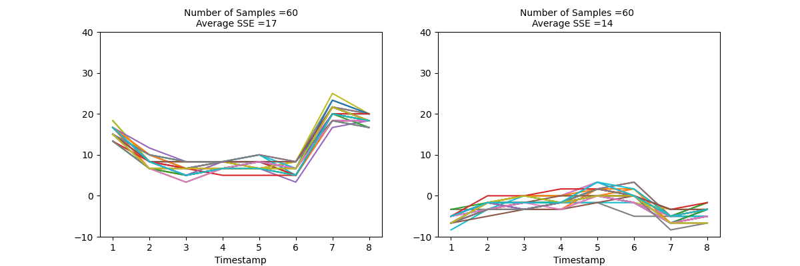

### **DEBE Breakdown occurs at n = 30 to n = 40**

<centre>Combined Plot</centre>

**n = 65**

**n = 60**

**n = 55**

**n = 50**

**n = 45**

**n = 40**

**n = 35**

**n = 30**

**n = 25**

**n = 20**

**n = 15**

**SSE Box Plot**

